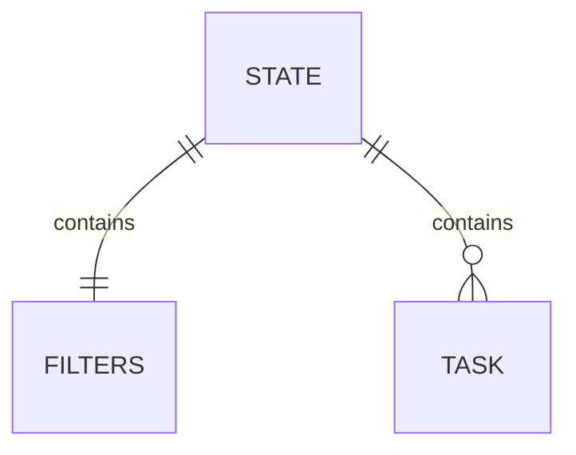

<!-- omit in toc -->
# ✅ Todo App

This todo app is designed to be incredibly simple and user-friendly, with a focus on providing just the minimal functionality needed to help users manage their tasks effectively. Despite its simplicity, the app includes all the basic features that users expect from a todo app, including the ability to create tasks and mark them as completed. The app's minimalist design and intuitive interface make it easy to use, with no unnecessary clutter or distractions.

<!-- omit in toc -->
## Table of Contents

- [Requirements](#requirements)
- [Data](#data)
- [Getting Started](#getting-started)
- [User Stories](#user-stories)

## Features

- 💚 Simple and user-friendly
- 🐜 Focus on minimal functionality
- 💪 Ability to add, edit and complete tasks

## Requirements

- An IDE like [Visual Studio Code](https://code.visualstudio.com).
- Basic [HTML, CSS and JavaScript](https://developer.mozilla.org/en-US/docs/Learn) skills.
- A browser like [Chrome](https://www.google.com/chrome).

## Data



## Getting Started

1. Clone the repository

```
git clone https://github.com/schalkventer/schalkventer.git
```

2. Run a localhost server

3. Open `index.html`.

## User Stories

- 👤 As a user, I want to see a list of tasks so that I can keep track of what needs to be done.
- 👤 As a user, I want to create a new task so that I can keep track of what needs to be done.
- 👤 As a user, I want to edit task details to ensure the information is accurate if it changes.
- 👤 As a user, I want to be able to delete tasks once they are completed to organize my task list.
- 👤 As a user, I want to be able to delete a task so that I can remove incorrect tasks
- 👤 As a user, I want a confirmation step when deleting a task so that I avoid accidentally deleting.
- 👤 As a user, I want to set urgency for tasks so that I can focus on the most important tasks first.
- 👤 As a user, I want to add due dates to tasks so that I can plan my work schedule more effectively.
- 👤 As a user, I want to mark tasks as complete so that I can track my progress and accomplishments.
- 👤 As a user, I want to filter and sort tasks by priority so that I can focus on a subsets of tasks.
- 👤 As a user, I want to search for tasks by keyword so that I can easily find specific tasks.
